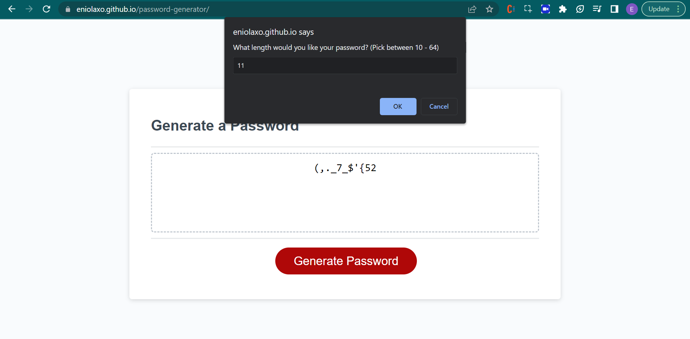

# password-generator

## Introduction
I will create an application that an employee can use to generate a random password based on criteria they’ve selected.

To do this, I used JavaScript .

## Features
- Prompts users to pick character length
- Prompts users to pick what kind of characters they want (upper/lower/special/numeric case)

## Deployed Application
https://eniolaxo.github.io/password-generator/

